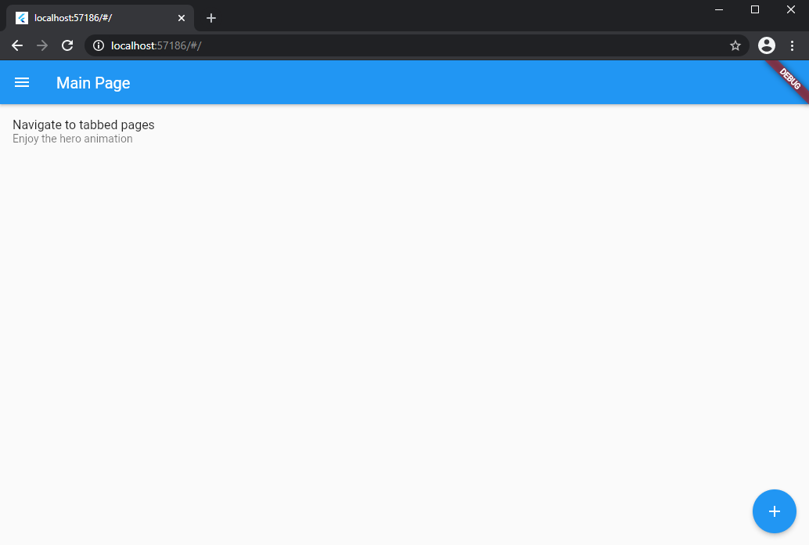
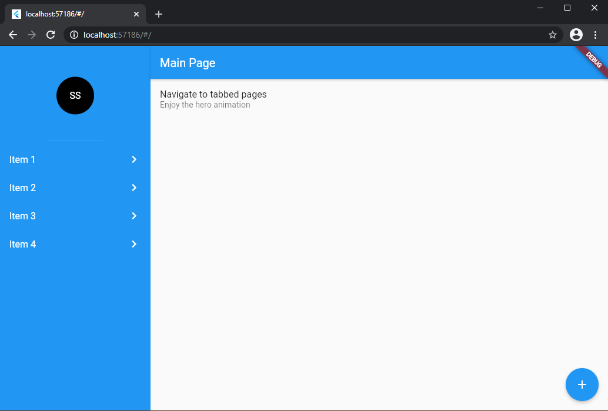

# Super Scaffold

An extension of Flutter Scaffold that pinns the Drawer on the left of screen if has enough space and fixes the Hero transitions between AppBars.

## What is the problem with default Scaffold?

If you are targeting just portrait screens, there is no problem with default Scaffold. But, if you want to make your application responsive to another orientation (like landscape), you'll see that behaviour:



So, how we can solve this problem?

## Pinning the Drawer on left of large screens

Unfortunately, default Scaffold does not have this feature yet. So, just replace your Scaffold widget with the SuperScaffold widget.

```dart
@override
Widget build(BuildContext context) {
    return SuperScaffold(
        drawer: Drawer(),
    );
}
```



All properties of Scaffold can be applied in SuperScaffold, like `appBar`, `body`, `floatingActionButton` and so on.

## Pinning the AppBar on the top of screen

If your application have some navigation, is natural put an AppBar on some screens.

Normally, the screen that we are navigating is pushed with some transition (like a slide animation), and this is fine in mobile experiences. But, if you want to pin this AppBars, just insert them inside a Hero widget.

```dart
@override
Widget build(BuildContext context) {
    return SuperScaffold(
        appBar: Hero(
            tag: "tag",
            child: AppBar(),
        )
        drawer: Drawer(),
    )
}
```

If one AppBar has an TabBar on the bottom property, follow theses steps:

1. Replace State with `SuperState` on your StatefulWidget that owns the TabBar.
2. Override the getter `tabsLength` from SuperState and insert the correct number of tabs.
3. Add the `tabController` from SuperState inside your TabBar and the TabBarView.

```dart
class _PageState extends SuperState<Page> {
    @override
    int get tabsLength => 3;

    @override
    Widget build(BuildContext context) {
        return SuperScaffold(
            appBar: AppBar(
                bottom: TabBar(
                    controller: tabController,
                    ...
                ),
            ),
            drawer: Drawer(),
            body: TabBarView(
                controller: tabController,
                ...
            ),
        );
    }
}
```

## Do you found an issue or have some question?

Feel free to contact me through GitHub repository.